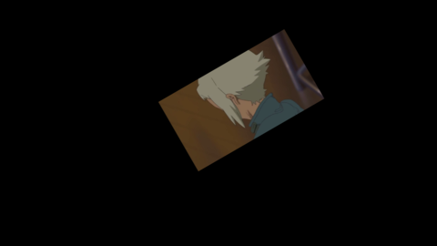
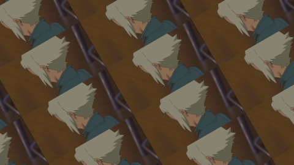
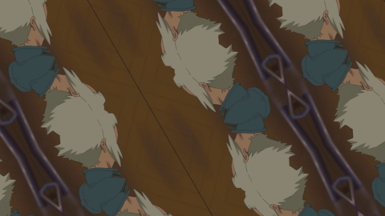
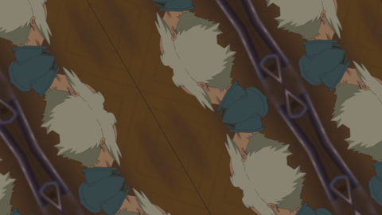
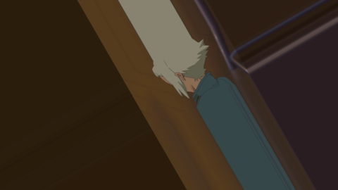

# はじめに
Rox Jockeyは**リアルタイムかつBPMに合わせて**フレームを再生するVJぽいソフトです。

JSON形式のプリセットファイルを編集することで、**特定のフレーム区間や画像**をキーボードイベントに割り当てることができます。
また前処理として、**スケール変更、座標変更、回転、トリミングやクロマキー処理**もプリセットを書き換えるだけで行わせることができます。

BPMは、設定されたキーをBPMに合わせて叩くことで変更できます。

**以下の二例はどちらも一つの動画ファイルとプリセットで動作しています。**
<video width="320" height="180" controls>
  <source type="video/mp4" src="vid/butterfly_example.mp4">
</video>
<video width="320" height="180" controls>
  <source type="video/mp4" src="vid/animated_example.mp4">
</video>

# 必要環境
- Windows 10 x64
- そこそこのCPUとメモリがあれば動作します。
  - i5-7300(2.6GHz)で動作確認済み
  - **GPUは一切使いません**

### 注意
- このソフトは**大量のメモリ**を使用します。**プログラムを実行すると、必要なメモリサイズがいったん表示される**のでよく確認してください。
- 実装しているクロマキー処理は一部のVTuberの映像でしかテストしておらず、汎用的にはおそらく機能しません。

# 動作の流れ
RoxJockeyは複数のJSONファイルによって動作します。
実際には以下のような流れで処理が進みます。

1. 同じディレクトリにある**config.json**の読み込み
2. **config.json**の`presets`に指定されたプリセットファイルを**presetsディレクトリ**から読み込み
3. プリセットファイルの`footage`に指定されたメディアファイルを**footagesディレクトリ**から読み込み
4. フレームをキーボードイベントに割り当てフルスクリーンウィンドウを生成

# 設定ファイル（config.json）
- JSON形式。初期設定は以下の通り:

```json
{
  "resolution": [1920,1080],
  "bpm": {
    "hold": "lcontrol",
    "beat": "return"
  },
  "presets":[
    "tutorial/sample.json"
  ]
}

```

## resolution (必須)
表示する映像の解像度を**[幅, 高さ]**で指定します。
- 使用しているディスプレイと指定された解像度が異なる場合、そのディスプレイにフィットするように自動的にスケールされます。
- 指定する解像度が小さいほど必要なメモリサイズは小さくなりますが、画質は粗くなります。
- プリセットによってはこの解像度に影響を受ける場合があります。

## bpm (required)
BPM設定用のキーを**二つ**設定します。
- `hold`で指定したキーを押している間、`beat`で指定したキーをBPMに合わせて叩くことで、BPMが設定されていきます。
- 初期設定では、**左コントロールキー**を押している間に**エンターキー**を押すことで、BPMを設定できます。設定を終える場合、**左コントロールキー**を離します。
- 押されたビートの間隔の平均をとるため、繰り返し数が増えると値が安定します。

## presets (必須)
**presetsディレクトリ**内のどのプリセットを読み込むかを指定します。

指定された順に、それぞれのプリセットは**数字キーの1～9,0**に割り当てられます。

## default_bpm (オプション)
ソフト起動時のBPMを設定します。デフォルトでは**125**に設定されています。

# プリセットファイル
- JSON形式。
- **後で発動したイベントほど前面に描画されます。**

例:
```json
[
  {
    "footage": "A.mp4",
    "frame_segment": [100,120],
    "event":  {
      "start": ["z","down"],
      "end": ["z","up"]
    },
    "keying":false
  },
  {
    "footage": "A.mp4",
    "frame_segment": [225,245],
    "event":  {
      "start": ["a","down"],
      "end": ["a","donw"]
    },
    "keying": true,
    "power_of_beat": 0,
    "condition":{
      "angle": -90,
      "scale": 1.7,
      "border": "wrap"
    }
  }
]
```

## footage (必須)
**footagesディレクトリ**内のどのメディアファイルを読み込むかを指定します。
- 画像ファイルも設定可能。

## frame_segment (必須)
`footage`で指定したメディアファイルのうち**再生するフレーム区間を[開始フレーム位置, 終了フレーム位置]**で設定します。
- `footage`に画像ファイルを設定した場合は必要ありません。

## event (必須)
イベントの**開始**`start`と**終了**`end`を設定します。
- それぞれ以下に示す**キーコード**と**キー状態**が必要です。
- 二つは同じキーである必要はありません。
- 同じイベントが複数存在しても問題ありません。同時に再生されるだけです。
- 例外として**"always"**を指定することも可能です。常にイベントが有効の状態になります。
```json
"event": "always"
```

#### キーコード
- **"a"~"z"**
- 特殊キー
  - **"return"**（エンターキー）
  - **"lcontrol"** / **"rcontrol"**
  - **"lshift"** / **"rshift"**
  - **"space"**

#### キー状態
- **"down"**
- **"up"**


## keying (必須)
クロマキー処理を適用するか**true**または**false**で指定します。
- **true**とした場合、グリーンスクリーンが除去されます。
- 任意の範囲を除去したい場合には、HSVカラーの値を設定することで可能です。
(`lower_hsv`~`upper_hsv`の色が除去されます)
```json
"keying":{
  "lower_hsv": [90, 35, 39],
  "upper_hsv": [180, 100, 100],
  "mask_erode_iteration": 2
}
```

## power_of_beat (オプション)
**何ビートで対象フレーム区間の再生を終えるかを設定できます。**
**デフォルトの値は0です。**
- ビートは**2<sup>power_of_beat</sup>**で計算されます。
- 例) 0の場合: 2<sup>0</sup> = 1ビート。 -2の場合: 2<sup>-2</sup> = 1/4ビート

## trim (オプション)
フレームを**[x座標, y座標, 幅, 高さ]で切り取ることができます**。
- 座標やサイズは**元映像の解像度に対して適用されます**。
- 座標は中央を原点とし、x座標は上にいくにれ、y座標は右にいくにつれて大きくなります。
- 元映像のサイズを超えたり、不正なボックスであった場合は読み込みがスキップされます。

## condition (オプション)
フレームに変更を与えます。以下が有効です。

例:
```json
"condition":{
  "coordinates": [200,200],
  "angle": -90,
  "scale": 1.7,
  "flip": "v",
  "grayscale": false,
  "border": "wrap"
}
```

### condition/ coordinates
対象フレームの中央を**どこに表示させるか**、**[x座標, y座標]**で設定できます。
- 座標は中央を原点とし、x座標は上にいくにれ、y座標は右にいくにつれて大きくなります。

### condition/ angle
**反時計回りに何度回転させるか**を設定できます。
- 負の値も設定可能です。

### condition/ scale
対象フレームを**何倍にスケールさせるか**を設定できます。


### condition/ flip
**反転**を設定できます。
- `v`: Vertical Flip。上下反転。
- `h`: Horizontal Flip。左右反転。
- `both`:上下左右反転。


### condition/ grayscale
**グレイスケールにするか**を設定できます。

### condition/ border
**フレームに生じる余白の扱い**を設定できます。
- **デフォルトでは"transparent"です。**
- 以下のパラメータが有効です。

|  border  |  result  |
| :--- | :---: |
|  transparent  |    |
|  wrap  |    |
|  reflect  |    |
|  reflect101  |    |
|  replicate  |    |
